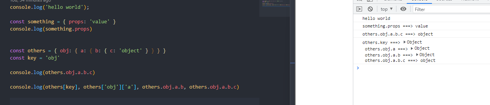
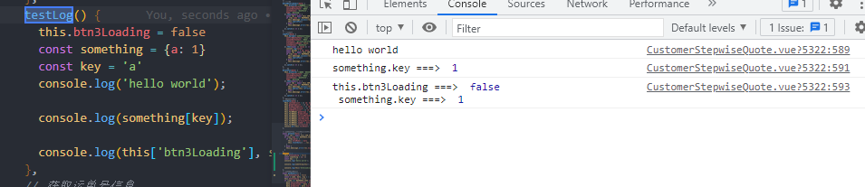

<!--
 * @Description: feature name
 * @Author: xujian
 * @Date: 2022-02-10 15:08:48
-->
# babel-plugin-better-log

解决控制台打印变量时，不知道哪个变量打印的是哪个值的问题。支持`object[key]`变量key，一次打印多个变量`console.log(a,b,c,d)` 时不仅会带上变量名，还会换行看起来更加清晰。  

**在普通的js文件中使用**  



**在Vue中使用**  



```js
// case1：单个字符串打印
console.log('hello world'); // 'hello world'

// case2：变量打印
const something = { props: 'value' }
console.log(something.props) // something.props ===> 'value'

const others = { obj: { a: { b: { c: 'object' } } } }
const key = 'obj'

// case3：深层变量打印
console.log(others.obj.a.b.c) // others.obj.a.b.c ===> 'object'

// case4：连续多个变量打印，并且key是动态的，打印结果会自动换行
console.log(others[key], others['obj']['a'], others.obj.a.b, others.obj.a.b.c)  // others.key ===> { a: { b: { c: 'object' } } }
                                                                                // others.obj.a ===> { b: { c: 'object' } }
                                                                                // others.obj.a.b ===> { c: 'object' }
                                                                                // others.obj.a.b.c ===> 'object'

```
## 用法
### 安装babel-插件
```bush
npm i babel-plugin-better-log --save-dev
```
### 配置babel-插件
babel-插件配置的**三种**方式都可以，具体看你项目的babel配置是写在哪里的
#### 1. 配置在 `babel.config.js` 里面
```js
const babelPluginBetterLog = require('babel-plugin-better-log');

module.exports = {
  presets: [
    // ...
  ],
  plugins:[
    [babelPluginBetterLog]
  ]
}
```

#### 2. 配置在 `.babelrc` 里面

```js
{
  // ...
  "plugins": [
    ['babel-plugin-better-log']
  ]
}
```


#### 2. 配置在 `babel-loader` 里面
> webpack.config.js
```js
const babelPluginBetterLog = require('babel-plugin-better-log');

module.exports = {
  // ...
  module: {
    rules: [
      {
        test: /\.js$/,
        exclude: /node_modules/,
        use: {
          loader: 'babel-loader',
          options: {
            plugins: [
              [babelPluginBetterLog]
            ]
          }
        }
      }
    ]
  }
  // ...
}
```

